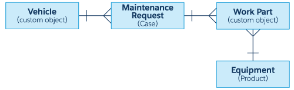

# Apex Specialist Superbadge

## What You'll Be Doing to Earn This Superbadge
Automate record creation using Apex triggers
Synchronize Salesforce data with an external system using asynchronous REST callouts
Schedule synchronization using Apex code
Test automation logic to confirm Apex trigger side effects
Test integration logic using callout mocks
Test scheduling logic to confirm action gets queued

## Concepts Tested in This Superbadge
Apex Triggers
Asynchronous Apex
Apex Integration
Apex Testing

## Pre-work and Notes

1. Create a new Trailhead Playground for this superbadge.

2. Install this unmanaged package (package ID: 04tB0000000Q3Cq). 
    /packaging/installPackage.apexp?p0=04tB0000000Q3Cq.
 This package contains all schema and shells for Apex logic needed to complete this challenge. 

## Standard Objects

Maintenance Request (renamed Case) — Service requests for broken vehicles, malfunctions, and routine maintenance.

Equipment (renamed Product) — Items in the warehouse used to fix or maintain RVs. Repair parts have a flag indicating that they are for repair.

## Custom Objects
Vehicle — Vehicles in HowWeRoll’s rental fleet. These records contain all stock parts that will eventually need replacement or maintenance.

Work Part — Equipment used for a maintenance request.

## Data Model

## Business Requirements

### Automate Maintenance Requests
1. Build in automation for their routine maintenance. One hard truth is that all parts eventually need servicing. You’ll build a programmatic process that automatically schedules regular checkups on these parts based on the date that the equipment and parts were installed.

2. When an existing maintenance request of type Repair or Routine Maintenance is Closed, you create a new maintenance request for a future routine checkup. This new request is tied to the same vehicle and piece of equipment to be serviced as the original closed service request. This new request's Type should be set as Routine Maintenance. The Subject should not be null and the Report Date field reflects the day the request was created. Another aspect about parts is they all have different lifespans. Therefore, you need to calculate and set the next due date using the maintenance cycle defined on the related work part records. If multiple work parts are used in the maintenance request, choose the shortest maintenance cycle to define the service date.

Automated process should work for both single maintenance requests and bulk maintenance requests. 

### Synchronize Inventory Management

Automate to Sync the Equipment data from Exteranal Backend Systems to Salesfrom. System you System you insert new Equipent and udpate the exsisting Equipment records. 

All data updates shouls happend during off hours at 1.00 am. 

### Project References
Github Repository : https://github.com/prishanf/apex-superbadge
Github Project : https://github.com/prishanf/apex-superbadge/projects/1
